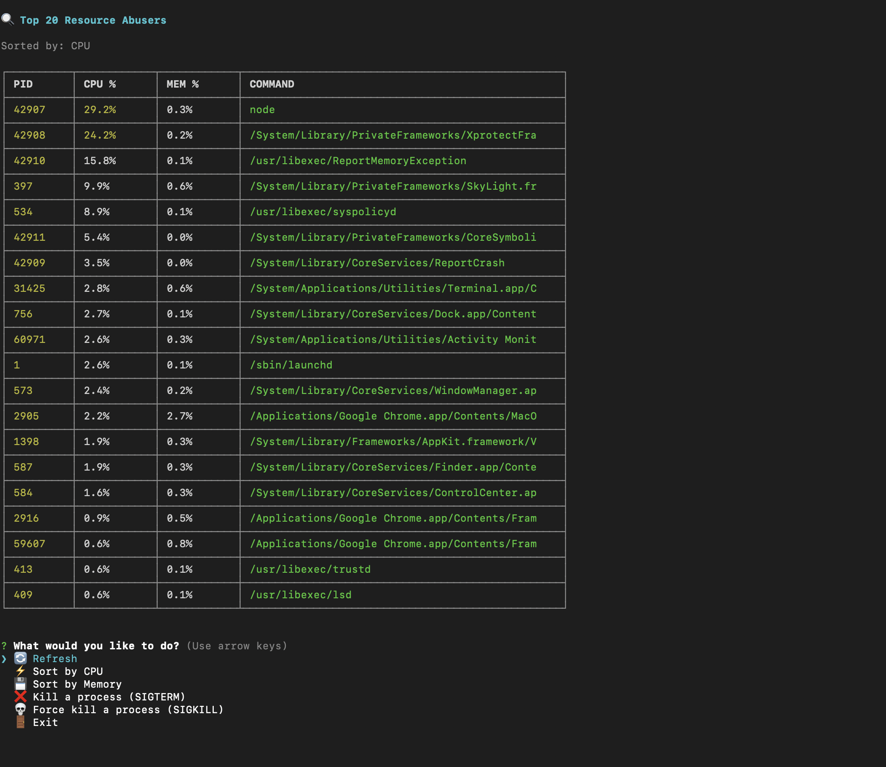

# Process Monitor & Killer

An interactive Node.js CLI tool to monitor and manage resource-intensive processes on your system.



## Features

- Display top 20 processes by CPU or Memory usage
- Beautiful color-coded table output
- Sort by CPU or Memory usage
- Interactive process selection with checkboxes
- Kill single or multiple processes
- Support for both SIGTERM (graceful) and SIGKILL (force) signals
- Real-time refresh capability

## Installation

```bash
pnpm install
```

## Usage

Run the script:

```bash
pnpm start
# or
node index.js
# or (if executable)
./index.js
```

## Menu Options

- **🔄 Refresh** - Reload process list with current data
- **⚡ Sort by CPU** - Display processes sorted by CPU usage (highest first)
- **💾 Sort by Memory** - Display processes sorted by Memory usage (highest first)
- **❌ Kill a process (SIGTERM)** - Gracefully terminate selected processes
- **💀 Force kill a process (SIGKILL)** - Forcefully terminate selected processes (use if SIGTERM fails)
- **🚪 Exit** - Quit the application

## How It Works

The tool uses the `ps` command to gather process information:
- **PID** - Process ID
- **CPU %** - Current CPU usage percentage
- **MEM %** - Current memory usage percentage
- **COMMAND** - Process name/command

### Color Coding

- **CPU/MEM > 50%** - Red (high usage)
- **CPU/MEM > 20%** - Yellow (moderate usage)
- **CPU/MEM < 20%** - White (normal usage)

## Permissions

Some processes may require `sudo` privileges to kill. If you encounter permission errors, run the script with:

```bash
sudo node index.js
```

## Safety Tips

1. Always use **SIGTERM** first - it allows processes to clean up gracefully
2. Use **SIGKILL** only when SIGTERM doesn't work
3. Be careful when killing system processes - it may cause system instability
4. Double-check the process list before confirming kills

## Dependencies

- `inquirer` - Interactive CLI prompts
- `chalk` - Terminal colors
- `cli-table3` - Beautiful table formatting

## License

ISC
